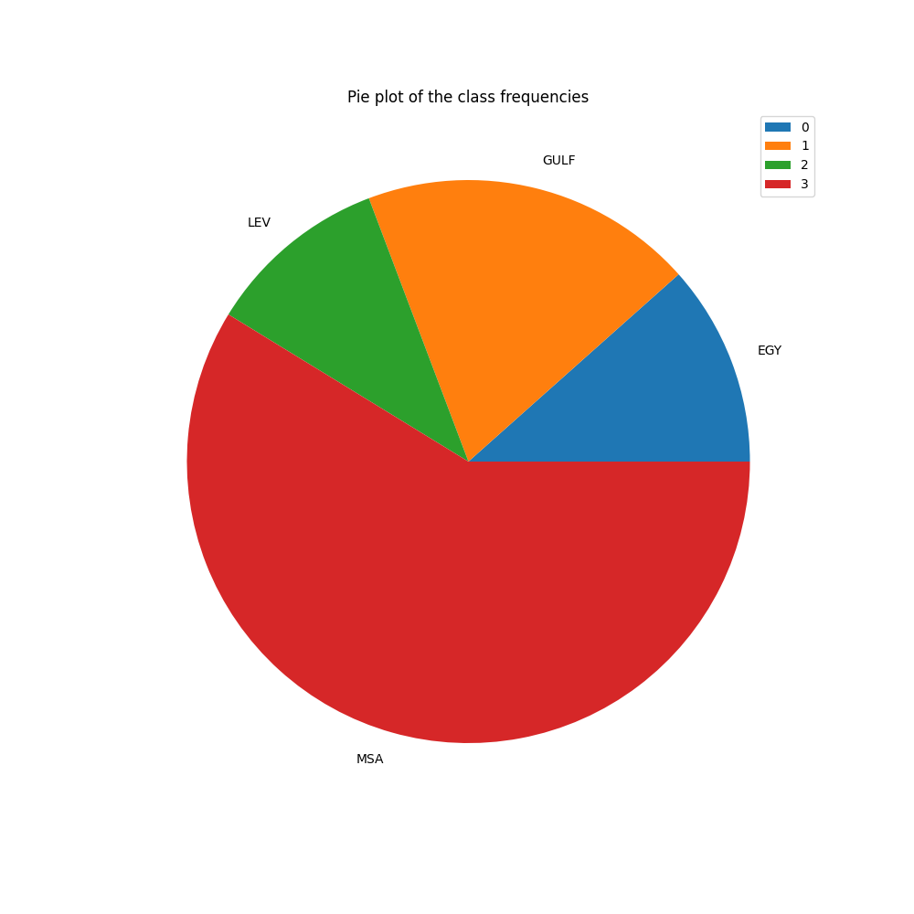
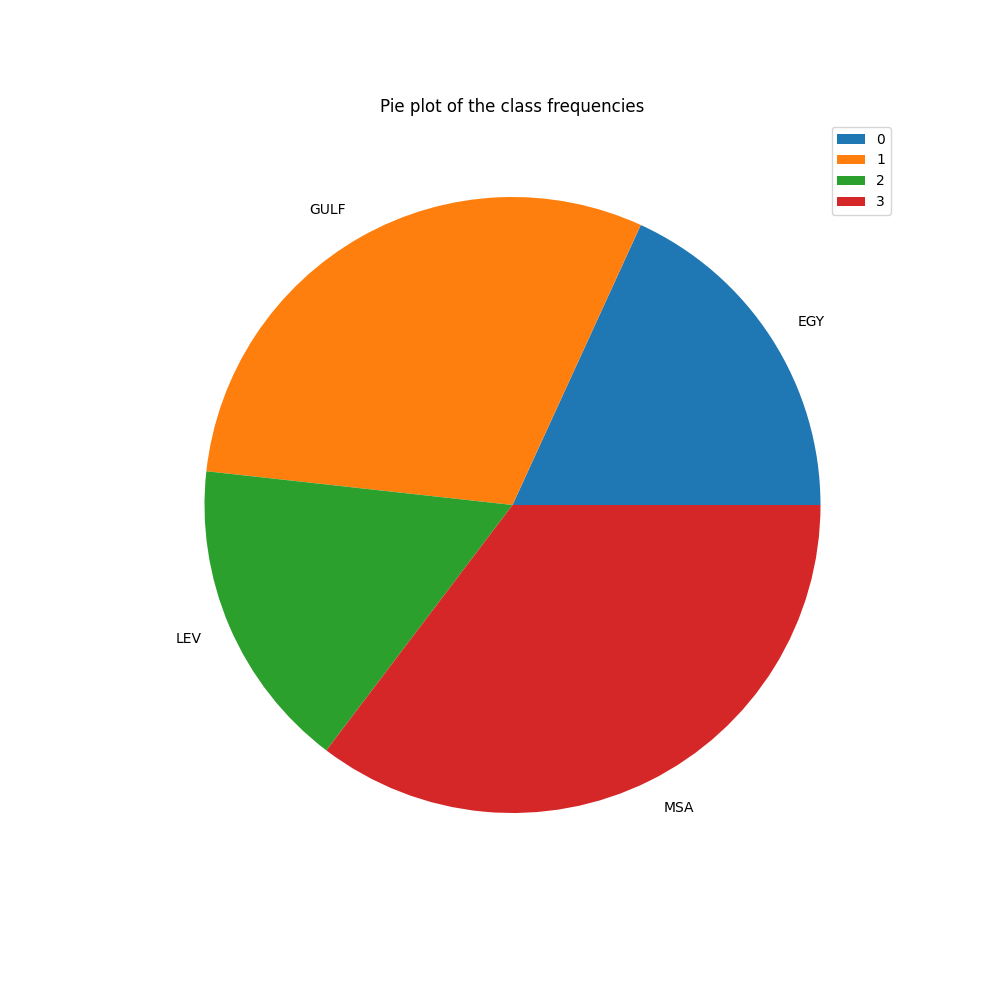
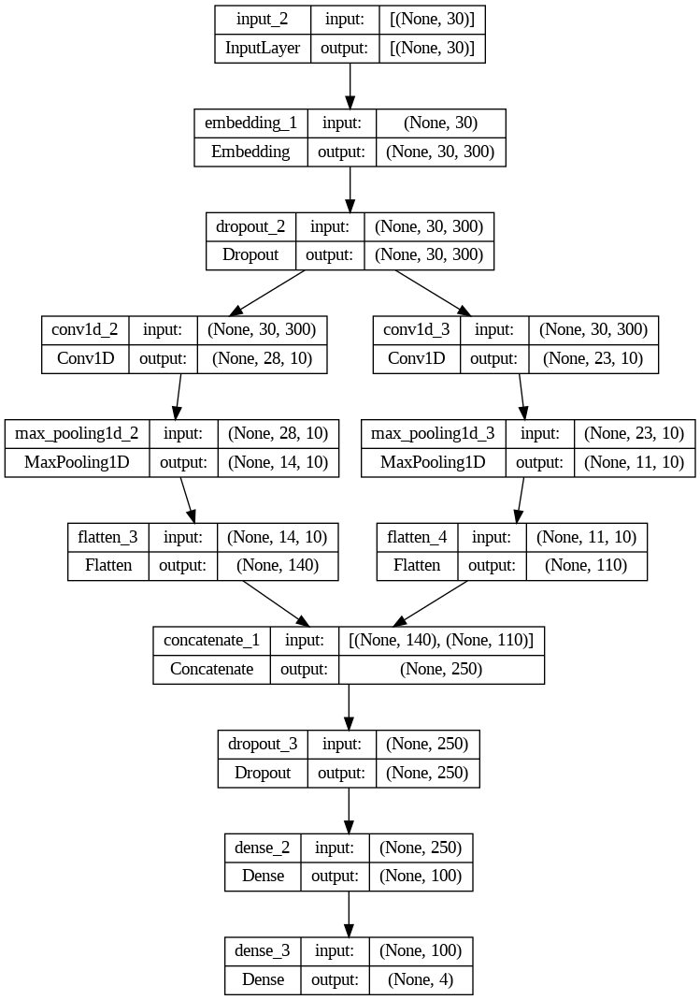
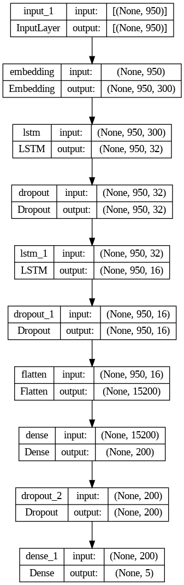

# Arabic Dialects Classifier

## Overview

This project focuses on classifying various Arabic dialects using deep learning models. The diversity of Arabic dialects poses challenges for natural language processing tasks, and this project aims to address these challenges by building an efficient classifier.

## Table of Contents

1. [Problem Statement](#problem-statement)
2. [Dataset](#dataset)
3. [Input/Output Examples](#inputoutput-examples)
4. [State of the Art](#state-of-the-art)
5. [Original Model from Literature](#original-model-from-literature)
6. [Proposed Updates](#proposed-updates)
7. [Results](#results)
8. [Comparison with Original Model and State of the Art](#comparison-with-original-model-and-state-of-the-art)
9. [Technical Report](#technical-report)
10. [Conclusion](#conclusion)

## Problem Statement

Arabic, one of the world's most widely spoken languages, exhibits a rich diversity of dialects across different regions in the Middle East. These dialects often pose challenges in natural language processing tasks such as speech recognition, sentiment analysis, and machine translation. Understanding and classifying these dialects is crucial for developing language technologies that can cater to the linguistic nuances of various Arabic-speaking communities.

Therefore, the problem statement for this project is to build a deep-learning model for Arabic dialects classification.

## Dataset

Our chosen dataset, the Arabic Online Commentary Dataset, is a remarkable collection of over 52 million words. It stands out as an essential tool for research, especially in the study of dialects. The dataset's uniqueness lies in the extensive and meticulous annotation process. Each sentence undergoes detailed examination to classify both the dialect level and the exact dialect it represents. As of now, it has accurately annotated 108,000 sentences, with about 41% of these sentences displaying unique dialectal features.

### Word Clouds

The word clouds below represent the most frequent terms in our dataset, illustrating the linguistic characteristics unique to each dialect class.

-  Word Cloud for Class DIAL_GLF
-  Word Cloud for Class DIAL_EGY
-  Word Cloud for Class DIAL_LEV
-  Word Cloud for Class MSA

### Class Distribution

These images display the class distribution in our dataset before and after applying data augmentation techniques. The augmentation process aimed to balance the class distribution, enhancing the model's ability to generalize across different dialects.

-  Dataset Before Augmentation
-  Dataset After Augmentation

## Input/Output Examples

Here are some examples to illustrate the dataset and our problem statement:

- **Input Sentence:** "وين الكلام ذا"  
  **Output:** "DIAL_GLF"

- **Input Sentence:** "من أمن العقوبة أساء الأدب"  
  **Output:** "MSA"

- **Input Sentence:** "كل واحد يشوف حاجة ما يشوفش منها غير اللي عايزة"  
  **Output:** "DIAL_EGY"

- **Input Sentence:** "يا خون مابصير تحكموعلى الناس منغير ما تشوفو"  
  **Output:** "DIAL_LEV"

## State of the Art

State-of-the-art models and their accuracies:

| Model                                                    | Accuracy |
| -------------------------------------------------------- | -------- |
| CNN (Kim, 2014)                                          | 64.17%   |
| CNN (Elaraby, 2018)                                      | 75.21%   |
| CNN [Different Dataset, Text Classification] (ElHachimi, 2019) | 94.54%   |
| LSTM (Elaraby, 2018)                                     | 82.42%   |
| LSTM [Different Dataset, Text Classification] (ElHachimi, 2019) | 94.57%   |

## Original Model from Literature

### Model A (Elaraby, 2018)

This is our primary base model, utilizing the AOC dataset for Arabic dialect classification. The CNN architecture is designed for extracting spatial hierarchies from the data, while the LSTM architecture captures long-term dependencies.

-  CNN Architecture
-  LSTM Architecture

### Model B Adapted for Comparison (ElHachimi, 2019)

This model is known for its high accuracy in text classification. We adapted and tested this model on our dataset to evaluate its performance in the context of Arabic dialect classification.

-  CNN Architecture
-  LSTM Architecture

## Proposed Updates

### Update #1: Different Embedding Models

We used different embedding models, and initial results have increased, especially when using the CBOW (Continuous Bag of Words) embedding pre-trained model.

### Update #2: Data Augmentation

We used various data augmentation techniques to balance the class distribution in our dataset, enhancing the model's ability to generalize across different dialects. The techniques include N-grams, random deletion, and random swap.

### Update #3: Attention Techniques

We implemented different attention techniques, such as Self Attention and Bahdanau Attention, to capture the most critical features in the input sentence.

### Update #4: Tuning and Regularization

We performed hyperparameter tuning and applied different regularizers like Dropout, L1, and L2 to enhance the model's accuracy.

### Update #5: Data Preprocessing

We utilized advanced data preprocessing techniques like Camel Normalization to improve the model's performance.

## Results

Below are the comparative results of our models, utilizing CBOW embedding, attention mechanisms, and data augmentation techniques:

### Model A Results

#### CNN Model Results

*CNN Initial*

*CNN with CBOW Embedding*

*CNN with Attention*

#### LSTM Model Results

*LSTM Initial*

*LSTM with CBOW Embedding*

*LSTM with Camel Normalization*

### Model B Results

#### CNN Model Results

*CNN with CBOW Embedding*

*CNN with Data Augmentation*

#### LSTM Model Results

*LSTM Initial*

*LSTM with CBOW Embedding*

*LSTM with CBOW and Data Augmentation*

*LSTM with Data Augmentation and Attention*

## Comparison with Original Model and State of the Art

Through strategic data augmentation, we have enhanced the quality of our dataset, leading to a notable performance boost in our models. Our refined approach, along with hyperparameter tuning, resulted in a commendable accuracy of 82.40% with the CNN architecture in Model B, surpassing the state-of-the-art results, which peaked at 75.21%.

**Note:** Our improvements were mainly due to the Embedding Model and Data Augmentation techniques, so there are no new diagrams from the model architectures.

## Technical Report

Details for the CNN model that produced the best results:

- **Programming Framework:** Keras
- **Training Hardware:** Google Colab T4 GPU
- **Training Time:** 10 minutes
- **Number of Epochs:** 20
- **Time per Epoch:** 30 seconds
- **Challenges:**
  - Limited GPU quota on Google Colab
  - Training time
  - Slow internet connection in Egypt

## Conclusion

The project provided valuable insights into Arabic dialect classification and highlighted the potential of embedding models, data augmentation techniques, and attention mechanisms to improve classification accuracy. Future work includes further refinement of the models and exploring additional features.
